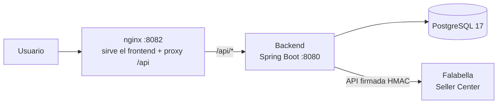

# D&K: sistema de análisis de rentabilidad omnicanal

Comercial D&K SpA (GATON PRODUCTS) vende en varios marketplaces. El precio de venta no
dice cuánto gana la empresa en cada operación, porque cada canal descuenta comisión y
logística por su cuenta. Este sistema cruza las ventas reales con los costos reales de cada
canal y calcula la rentabilidad por venta, producto y categoría.

El margen sale de tres fuentes:

| Fuente | Aporta | Cómo entra |
|--------|--------|------------|
| API de Falabella | el precio de venta | integración firmada (HMAC) → tabla `venta` |
| Bsale | el costo del producto | export CSV/XLSX → tabla `producto` |
| Estado de cuenta Falabella | comisión y logística | export CSV → tabla `costo_venta` |

Fórmula: `margen = precio - costo del producto - (comisión + logística)`

## Arquitectura



| Capa | Tecnología |
|------|------------|
| Frontend | React + Vite + TypeScript, Recharts |
| Backend | Spring Boot 3.5 (Java 21), Spring Security + JWT, JPA/Hibernate, Flyway |
| Base de datos | PostgreSQL 17 |
| Integraciones | Falabella Seller Center (API HMAC), Bsale (carga manual) |
| Despliegue | Docker Compose, con nginx como reverse proxy |

## Cómo levantarlo

### Opción A: Docker (recomendada, un comando)

Solo necesitas Docker Desktop. No hace falta instalar Java ni PostgreSQL.

```bash
cp .env.example .env      # (opcional) completa las claves de Falabella
docker compose up --build
```

Levanta los tres servicios (PostgreSQL ya poblado, backend y frontend) y deja la app en:

http://localhost:8082/  ·  cuenta demo: `kevin@dk.cl` / `changeme`

| Acción | Comando |
|--------|---------|
| Parar (conserva los datos) | `docker compose down` |
| Parar y resetear la BD | `docker compose down -v` |
| Reconstruir tras cambios de código | `docker compose up --build` |

La base se puebla sola desde `docker/postgres-initdb/01-dump.sql` (1.231 ventas reales con
sus costos). El backend queda oculto en la red interna; la única cara pública es nginx.

### Opción B: Manual (desarrollo)

Requisitos: JDK 21, PostgreSQL 17, Node.js 20+.

```bash
# 1. Base de datos
createdb "D&K"           # o:  CREATE DATABASE "D&K";  (Flyway crea el esquema al arrancar)

# 2. Backend  → http://localhost:8080
cd DK-Backend
cp .env.example .env     # ajusta DB_PASSWORD, JWT_SECRET y credenciales Falabella
./gradlew bootRun

# 3. Frontend → http://localhost:5173
cd DK-Frontend
npm install
npm run dev
```

Para repoblar los datos (productos, ventas, costos) en una base limpia, sigue
[DK-Backend/docs/levantar-y-repoblar.md](DK-Backend/docs/levantar-y-repoblar.md).

## Pruebas

```bash
cd DK-Backend
./gradlew test
```

Cubren la funcionalidad crítica: el cálculo del margen (`RentabilidadService`), el login y
el control de acceso (`AuthService`, bloqueo por intentos), la firma HMAC de Falabella y una
prueba de integración de la capa web (`AuthControllerIntegrationTest`).

## Estructura del repositorio

```
├── DK-Backend/          API Spring Boot (Java 21)
│   ├── src/main/…       controllers · services · repositories · entities
│   ├── src/test/…       pruebas (JUnit 5 + Mockito)
│   ├── datos/           semillas y CSV reales (productos, costos, estado de cuenta)
│   └── docs/            runbooks y notas técnicas
├── DK-Frontend/         UI React (Vite + TypeScript)
├── docker/              dump de la BD para el arranque de Docker
├── docker-compose.yml   orquesta db + backend + frontend
└── .env.example         plantilla de variables (copiar a .env)
```

## Variables de entorno

Para Docker van en el `.env` de la raíz; para el modo manual, en `DK-Backend/.env`. Los dos
`.env` están en `.gitignore` para no subir secretos.

| Variable | Descripción | Default |
|----------|-------------|---------|
| `DB_PASSWORD` | contraseña de PostgreSQL | `postgres` |
| `JWT_SECRET` | secreto para firmar los JWT (mín. 32 caracteres) | requerido en prod |
| `SPRING_PROFILES_ACTIVE` | perfil de Spring (`dev` / `prod`) | `dev` |
| `FALABELLA_USER_ID` · `FALABELLA_API_KEY` · `FALABELLA_SELLER_ID` | credenciales de la API de Falabella (opcionales) | vacío |

Sin credenciales de Falabella la app arranca igual: el dashboard funciona con los datos
cargados y solo el explorador en vivo queda sin conexión.

## Integraciones

| Módulo | Responsable | Estado |
|--------|-------------|--------|
| Falabella (ventas) | Vladimir | Listo: API HMAC, sincronización y explorador en vivo |
| Bsale (costos / catálogo) | Ximena | Listo: carga manual desde Excel/CSV (productos y stock) |
| Comisiones por canal | Equipo | Listo: edición desde el frontend (`/api/canales`) |
| MercadoLibre, Walmart y otros | Juan | Pendiente |

## Documentación

| Documento | Contenido |
|-----------|-----------|
| [DK-Backend/README.md](DK-Backend/README.md) | Detalle del backend, endpoints y Swagger |
| [DK-Backend/docs/levantar-y-repoblar.md](DK-Backend/docs/levantar-y-repoblar.md) | Instalar y repoblar datos en una base limpia |
| Swagger UI (perfil `dev`, backend corriendo) | http://localhost:8080/swagger-ui.html |
