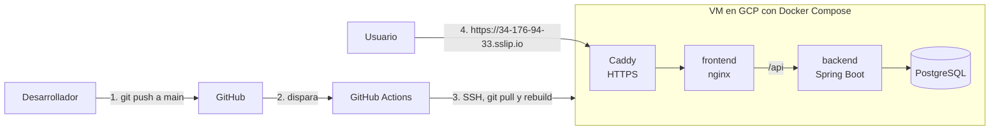

# Despliegue en producción

Este documento describe cómo está desplegado el sistema en la máquina virtual (VM), qué piezas lo componen y cómo reproducirlo desde cero si hiciera falta. Sirve para que cualquier integrante del equipo pueda mantener o rehacer el despliegue, no solo quien lo montó.

## Dónde corre

- **URL de producción:** https://34-176-94-33.sslip.io/
- **Login de demo:** kevin@dk.cl / changeme
- **VM:** Google Cloud Platform (Compute Engine), instancia `dk-demo`, zona `southamerica-west1-b`, Ubuntu 22.04.
- **Repositorio en la VM:** `/home/deploy/PingesoD-K`, bajo el usuario `deploy`.

El dominio usa [sslip.io](https://sslip.io), un servicio que resuelve un hostname a partir de una IP (`34-176-94-33.sslip.io` apunta a `34.176.94.33`). Así se obtiene un nombre de dominio sin comprar uno, lo que permite que Caddy emita un certificado HTTPS válido.

## Flujo general

El diagrama resume cómo un cambio llega a producción y cómo un usuario usa la app. Un push a `main` dispara el despliegue automático (pasos 1 a 3). El usuario entra por HTTPS (paso 4), que Caddy termina antes de pasar la petición al frontend y, si corresponde, al backend y la base de datos.



## Cómo está armado

Todo corre con Docker Compose. El archivo `docker-compose.yml` (en la raíz del repo) define tres servicios:

| Servicio | Qué es | Puerto |
|---|---|---|
| `db` | PostgreSQL 17, poblado desde el dump en `docker/postgres-initdb/` | interno (5432) |
| `backend` | Spring Boot, no expuesto al host | interno (8080) |
| `frontend` | nginx sirve el build y hace de proxy a `/api` hacia el backend | 8081 en el host |

El backend no se publica al host: solo se llega a él a través del frontend. Sobre este stack, en la VM se agrega Caddy (ver más abajo) como capa de HTTPS.

Para levantar todo:

```bash
cd ~/PingesoD-K
docker compose up -d
```

## Perfil de producción

La VM corre con el perfil `prod` de Spring, definido en su `.env`:

```
SPRING_PROFILES_ACTIVE=prod
```

El perfil `prod` deshabilita los endpoints de desarrollo (`/api/dev/*`) y la documentación Swagger. El default del `docker-compose.yml` es `dev` (útil en local); la VM lo sobrescribe con su `.env`.

En Docker el backend debe escuchar en todas las interfaces del contenedor para que el frontend lo alcance por la red interna. Eso lo resuelve el `docker-compose.yml`, que define `SERVER_ADDRESS: 0.0.0.0` para el backend. No hay que configurarlo a mano.

## HTTPS con Caddy

El HTTPS lo provee Caddy como proxy inverso delante del frontend. Caddy obtiene y renueva solo un certificado de Let's Encrypt. Dos archivos, que viven **solo en la VM**, lo configuran:

**`Caddyfile`** (en `~/PingesoD-K`):

```
34-176-94-33.sslip.io {
    reverse_proxy frontend:80
}

http://34.176.94.33 {
    redir https://34-176-94-33.sslip.io{uri} permanent
}
```

**`docker-compose.override.yml`** (en `~/PingesoD-K`), que agrega el servicio Caddy al stack:

```yaml
services:
  caddy:
    image: caddy:2
    restart: unless-stopped
    ports:
      - "80:80"
      - "443:443"
    volumes:
      - ./Caddyfile:/etc/caddy/Caddyfile:ro
      - caddy_data:/data
      - caddy_config:/config
    depends_on:
      - frontend

volumes:
  caddy_data:
  caddy_config:
```

El volumen `caddy_data` guarda el certificado, para que no se vuelva a emitir en cada reinicio. Docker Compose lee `docker-compose.override.yml` de forma automática junto al `docker-compose.yml` base, así que `docker compose up -d` levanta también Caddy.

Estos dos archivos no están en el repositorio porque contienen el dominio y la IP específicos de esta VM. Conviene guardarlos aparte (o commitearlos como plantilla) para no perder la configuración de HTTPS si la VM se cae.

## Variables del `.env` de la VM

El `.env` de la VM (en `~/PingesoD-K/.env`) define los valores propios del entorno. No está en el repositorio. Las variables relevantes:

| Variable | Para qué | Valor en la VM |
|---|---|---|
| `SPRING_PROFILES_ACTIVE` | Perfil de Spring | `prod` |
| `DB_PASSWORD` | Clave de la base de datos | (secreto) |
| `JWT_SECRET` | Secreto para firmar los JWT (mínimo 32 caracteres) | (secreto largo) |
| `CORS_ALLOWED_ORIGINS` | Orígenes que el navegador puede usar contra la API | `https://34-176-94-33.sslip.io` |
| `FALABELLA_USER_ID` | Credencial de la API de Falabella | (secreto) |
| `FALABELLA_API_KEY` | Credencial de la API de Falabella | (secreto) |
| `FALABELLA_SELLER_ID` | Credencial de la API de Falabella | (secreto) |

`CORS_ALLOWED_ORIGINS` es sensible: si no coincide con el dominio desde el que se abre la app, el navegador recibe un 403 "Invalid CORS request" al iniciar sesión. Si algún día cambia el dominio de la VM, hay que actualizar esta variable y recrear el backend con `docker compose up -d`.

## Despliegue automático (CI/CD)

Cada push a la rama `main` despliega solo a la VM. Lo hace el workflow `.github/workflows/deploy.yml` con la acción `appleboy/ssh-action`: se conecta por SSH a la VM y corre

```bash
cd ~/PingesoD-K && git pull && docker compose up --build -d
```

El workflow usa tres secrets del repositorio (Settings, Secrets and variables, Actions):

| Secret | Contenido |
|---|---|
| `VM_HOST` | La IP de la VM (`34.176.94.33`) |
| `VM_USER` | El usuario de despliegue (`deploy`) |
| `VM_SSH_KEY` | La clave SSH privada del usuario `deploy` |

Tras cada push conviene revisar la pestaña **Actions** del repositorio y confirmar que la corrida "Deploy a la VM" salió en verde.

### El usuario `deploy`

El despliegue no corre bajo la cuenta personal, sino bajo un usuario dedicado `deploy`, creado con `--disabled-password` y agregado al grupo `docker`. Su par de claves SSH se generó en la VM: la clave pública quedó en `~deploy/.ssh/authorized_keys` y la privada se cargó en el secret `VM_SSH_KEY`. El repositorio está clonado en `/home/deploy/PingesoD-K`.

## Reproducir el despliegue desde cero

Si hubiera que rehacer la VM:

1. Crear una VM en GCP (Ubuntu), con los puertos 80 y 443 abiertos en el firewall.
2. Instalar Docker y el plugin de Docker Compose.
3. Crear el usuario `deploy` (`--disabled-password`), agregarlo al grupo `docker` y configurarle un par de claves SSH.
4. Clonar el repositorio en `/home/deploy/PingesoD-K`.
5. Crear el `.env` con los valores de la tabla de arriba (perfil `prod`, secretos y `CORS_ALLOWED_ORIGINS` con el dominio real).
6. Crear el `Caddyfile` y el `docker-compose.override.yml` con el contenido de la sección de HTTPS.
7. Levantar el stack: `docker compose up --build -d`.
8. Cargar los tres secrets (`VM_HOST`, `VM_USER`, `VM_SSH_KEY`) en el repositorio para reactivar el auto-deploy.

## Respaldo y recuperación

Los datos de PostgreSQL viven en el volumen de Docker `dk_pgdata`. Los datos iniciales provienen del dump versionado en el repositorio (`docker/postgres-initdb/01-dump.sql`), que se carga la primera vez que arranca la base. Flyway aplica sobre ese dump las migraciones más nuevas (V7 en adelante).

Para recuperar el sistema en otra máquina basta con el repositorio (que incluye el dump y las migraciones) y volver a levantar el stack. La base se reconstruye desde el dump; los datos que se hayan cargado después (por ejemplo importaciones manuales) habría que respaldarlos aparte con `pg_dump` si se quieren conservar.
